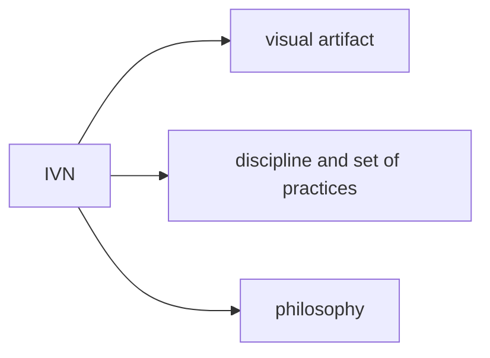
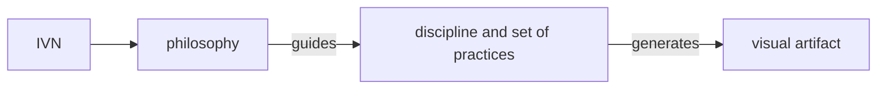

## Creating and maintaining an Integrated Value Network artifact

The IVN (Integrated Value Network) is a discipline, philosophy, and set of supporting practices for creating and maintaining
a high-level of situational awareness for (large) organizations, over time.

* IVN is an organizational artifact.
* IVN is an organizational discipline and set of practices.
* IVN is an organizational philosophy.

The IVN is composed of the following common organizational documents. These can be referred to as the P5.

1. Policy
1. (Strategic) Plans
1. (Management) Priorities
1. Programs
1. Performance (Goals)

---

### IVN as an artifact

The network node diagram is the common artifact where most people first engage with the IVN. __This "view" can be thought of as a report, based on the underlying structured data, much like how an Income Statement, Balance Sheet, Budget, or Transaction listing are reports based on underlying financial data.__

The node diagram (affectionately called "The Death Star" diagram),
visually conveys how organizational Policy, (Strategic) Plans, (Management) Priorities, Programs, and Performance (Goals) are connected.

##### Additional views

A subset of the full network, filtering for a single Policy is called a **Policy View**.

A subset of the full network, filtering for a single Priority is called a **Priority View**.

A subset of the full network, filtering for a single Program is called a **Program View**.

A subset of the full network, filtering for a single Goal is called a **Goal View**.

### IVN as a discipline and set of practices

To create the IVN model,
begin by identifying as many P5 as possible.

List each Policy, Priority, Program, and Performance Goal as a
"Component" which have the following attributes:

* Unique Identifier
* Name
* Description
* URL
* Kind [policy, plan, priority, program, performance_goal]

Then, connect the Components with a Link. A Link has the following attributes:

* Unique Identifier
* From Component ID
* To Component ID
* (optional) Description

The IVN node graph emerges when many Components are connected with Links.

### IVN as a philosophy

IVN begins with the assumption that an organization is a living organism
and many interconnected concepts, taken together, can represent the structure, operations, and behavior of an organization.

Simon Wardley and many other strategists have made the case
for modeling an organization and its value streams.

Starting with Policy,
it follows that Strategic Plans are crafted in accordance with existing Policy.
Management Priorities are expressed in Strategic Plans
and manifest through Programs.
Programs are measured via Performance Goals.
And Performance Goals are also often expressed in Strategic Plans
and referenced as Priorities.

The coherence of these concepts, along with their actual implementation, as performed by people in the organization,
represent a working model of the organization. And this model,
if accurate and informative, can be used to assess, guide, and evolve an organization's operations to best serve customers.